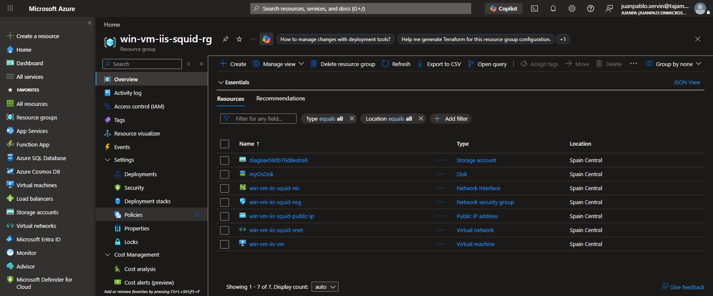
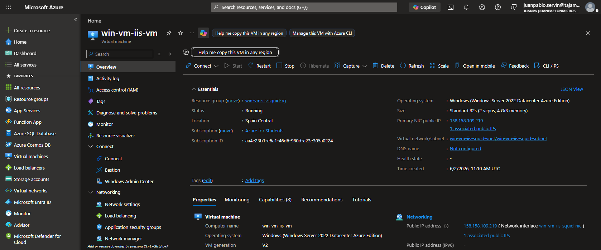
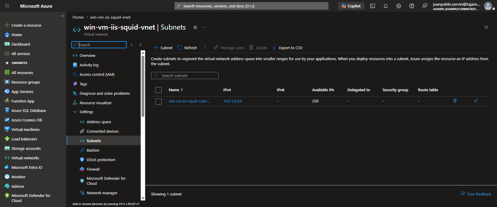
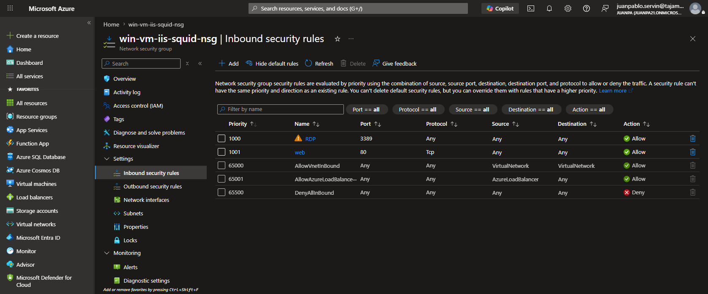
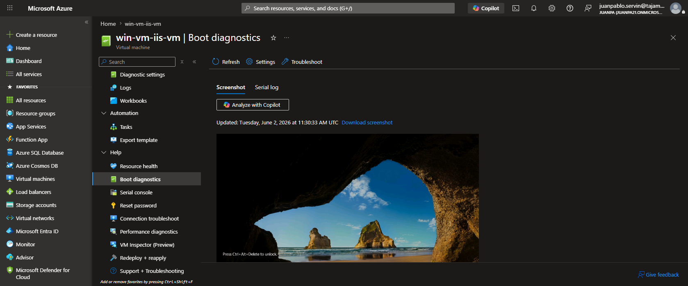
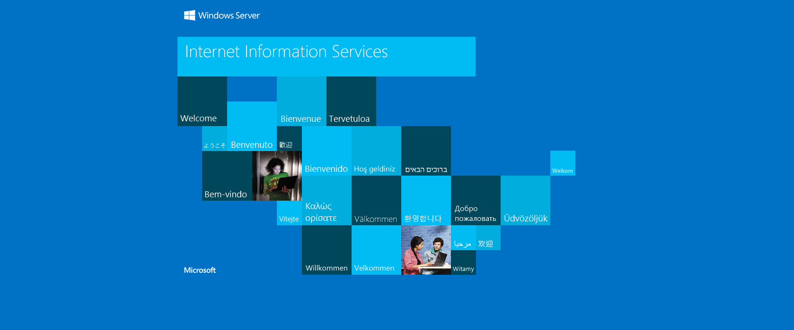

# Documentación Completa y Evidencias de Despliegue en Azure (Terraform)

Este documento contiene un análisis exhaustivo de la infraestructura como código (IaC) implementada mediante Terraform para la creación de un Grupo de Recursos base (`01 Resource Group`) y una Máquina Virtual con servidor web IIS (`02 VM`), aportando evidencias visuales, configuraciones técnicas de red y grabaciones en vivo extraídas directamente desde el Portal de Azure.

---

## 1. Análisis del Código de Infraestructura (Terraform)

La solución de infraestructura está estructurada de forma modular en dos fases lógicas de aprovisionamiento:

```
c:\Proyectos\
├── 01 Resource Group/
│   ├── main.tf           # Grupo de recursos de control base (RG1)
│   └── terraform.tfstate # Estado del despliegue base
└── 02 VM/
    ├── providers.tf      # Configuración del proveedor de Azure (azurerm)
    ├── variables.tf      # Declaración de variables configurables
    ├── main.tf           # Definición de red virtual, seguridad, storage y VM
    ├── outputs.tf        # Definición de salidas (IP pública, nombres, etc.)
    └── terraform.tfstate # Estado del despliegue de la VM
```

---

### 1.1. Fase 1: Grupo de Recursos Base (`01 Resource Group`)

Despliega el grupo de recursos inicial para la gobernanza básica de la suscripción.

#### **main.tf**
* **Proveedor**: Requiere `azurerm` en versión `~> 4.0`.
* **Recurso**: `azurerm_resource_group.rg1`
  * **Nombre**: `RG1`
  * **Ubicación**: `westeurope` (Europa Occidental).

```hcl
terraform {
  required_providers {
    azurerm = {
      source  = "hashicorp/azurerm"
      version = "~> 4.0"
    }
  }
}

provider "azurerm" {
  features {}
}

resource "azurerm_resource_group" "rg1" {
  name     = "RG1"
  location = "westeurope"
}
```

---

### 1.2. Fase 2: Entorno Completo de la VM (`02 VM`)

Implementa la topología de red, almacenamiento, seguridad y cómputo para hospedar un servidor IIS en Windows Server.

#### **variables.tf**
Permite parametrizar y reutilizar el código de manera limpia:
* `resource_group_location`: Ubicación por defecto de la infraestructura (`spaincentral` / España Central).
* `prefix`: Prefijo único para el nombrado de recursos (`win-vm-iis`).

#### **main.tf (Estructura Técnica)**

1. **Generadores Dinámicos**:
   * `random_pet.prefix`: Genera un nombre de mascota aleatorio único (ej. `win-vm-iis-squid`) para evitar colisiones en nombres globales de DNS de Azure.
   * `random_id.random_id`: Genera un hash hexadecimal único de 8 bytes ligado al ciclo de vida del grupo de recursos.
   * `random_password.password`: Genera una contraseña segura y compleja de 20 caracteres para el administrador local de Windows.

2. **Grupo de Recursos de Cómputo**:
   * `azurerm_resource_group.rg`: Nombrado de manera dinámica como `${random_pet.prefix.id}-rg` en `spaincentral`.

3. **Topología de Red Privada**:
   * `azurerm_virtual_network.my_terraform_network`: Red virtual (VNet) con espacio de direccionamiento `10.0.0.0/16`.
   * `azurerm_subnet.my_terraform_subnet`: Subred con direccionamiento privado `10.0.1.0/24`.
   * `azurerm_public_ip.my_terraform_public_ip`: Dirección IP pública estática de SKU Standard.

4. **Cortafuegos Perimetral (NSG)**:
   * `azurerm_network_security_group.my_terraform_nsg`: Administra las reglas de firewall:
     * **Regla RDP (Puerto 3389)**: Prioridad 1000, permite el control remoto.
     * **Regla Web (Puerto 80)**: Prioridad 1001, permite el tráfico HTTP para IIS.

5. **Aprovisionamiento de la VM y IIS**:
   * `azurerm_windows_virtual_machine.main`: Crea el servidor Windows Server 2022 Datacenter con tamaño `Standard_B2s` (2 vCPUs, 4 GB RAM) y almacenamiento Premium SSD.
   * `azurerm_virtual_machine_extension.web_server_install`: Extensión `CustomScriptExtension` que autoinstala IIS de manera desatendida mediante PowerShell al arrancar:
     ```powershell
     powershell -ExecutionPolicy Unrestricted Install-WindowsFeature -Name Web-Server -IncludeAllSubFeature -IncludeManagementTools
     ```

---

## 2. Evidencias y Capturas Técnicas de Azure Portal

A continuación, se documenta la creación física de cada recurso mediante capturas tomadas en tiempo real.

### 2.1. Lista de Recursos Aprovisionados (`win-vm-iis-squid-rg`)
Confirmación de que todos los recursos definidos en HCL se crearon en la región de España Central bajo la misma jerarquía de recursos:



### 2.2. Estado de la VM Windows (`win-vm-iis-vm`)
Detalle del servidor virtual mostrando estado **Running** (En ejecución), tamaño **Standard B2s** en España Central e IP pública asignada `158.158.109.219`:



### 2.3. Topología de Subredes en la Red Virtual (VNet)
Muestra la configuración de la red virtual `win-vm-iis-squid-vnet` con su subred interna `win-vm-iis-squid-subnet` acotada con el CIDR `10.0.1.0/24`:



### 2.4. Reglas de Inbound Security en el NSG
Validación física del cortafuegos de Azure que habilita el tráfico entrante sobre el puerto 3389 (RDP) y el puerto 80 (HTTP) tal como se definió en Terraform:



### 2.5. Diagnóstico de Arranque (Boot Diagnostics Screen)
Esta captura constituye la prueba definitiva de salud de la VM. Al ingresar a la sección de diagnóstico de arranque, la GPU virtual de Azure nos entrega una vista directa del monitor físico del servidor, confirmando que Windows Server ha cargado exitosamente y se encuentra en la pantalla de bloqueo esperando credenciales de acceso:



### 2.6. Acceso Público al Servidor Web IIS
Comprobación final de conectividad externa en un navegador accediendo a la IP pública `http://158.158.109.219`, cargando exitosamente la pantalla de bienvenida por defecto de IIS de Microsoft:



---

## 3. Grabaciones e Interacciones del Navegador

Se dispone de 3 grabaciones en vivo que registran de forma transparente la verificación interactiva en el Portal de Azure:

1. **[Grabación General del Grupo de Recursos y VM](./recording.webm)**: Registro de los recursos generales y estado de encendido de la máquina.
2. **[Grabación de Red y Configuración Perimetral](./recording_extra.webm)**: Registro de la verificación de reglas del NSG y topología de la VNet.
3. **[Grabación del Diagnóstico de Arranque del Sistema Operativo](./recording_boot.webm)**: Registro de la consola visual y pantalla de logon de Windows Server.
